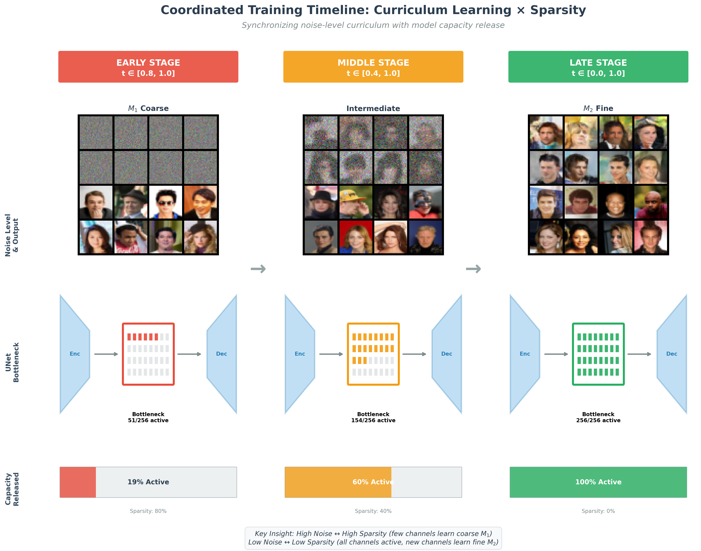

# minDiffusion with Curriculum Learning

<!-- #region -->
<p align="center">

</p>

This repository extends the original [minDiffusion](https://github.com/cloneofsimo/minDiffusion) with **Curriculum Learning** and **Sparsity Regularization** for diffusion models.

## Key Features

- **Curriculum Learning**: Train from high-noise to low-noise time steps progressively
- **Sparsity Curriculum (CS)**: Hard mask on bottleneck channels with gradual regrowth
- **Group L1 Regularization (CR)**: Soft sparsity via L1 penalty on Conv output channels

## Training Variants

| Script | Curriculum | Sparsity | Method |
|--------|:----------:|:--------:|--------|
| `train_celeba_c_32.py` | ✓ | ✗ | Curriculum only |
| `train_celeba_cs_32.py` | ✓ | ✓ | Hard mask + regrowth |
| `train_celeba_cr_32.py` | ✓ | ✓ | Group L1 regularization |

## Curriculum Strategy

```
Stage 1: t ∈ [0.8, 1.0] - High noise (easy)
Stage 2: t ∈ [0.6, 1.0] - Expand range
Stage 3: t ∈ [0.4, 1.0] - Continue expanding
Stage 4: t ∈ [0.2, 1.0] - Near complete
Stage 5: t ∈ [0.0, 1.0] - Full range (hard)
```

## Group L1 Regularization (CR)

```
L_total = MSE(pred, target) + λ · Σ_(all Conv) Σ_c ||W[c,:,:,:]||_2
```

- λ decreases from `lambda_max` to 0 via cosine schedule
- Encourages channel-level sparsity without hard masks

## Usage

```bash
# Single GPU
CUDA_VISIBLE_DEVICES=0 torchrun --nproc_per_node=1 train_celeba_cr_32.py

# Multi GPU
torchrun --nproc_per_node=4 train_celeba_cr_32.py

# Specify different port (if port conflict)
torchrun --nproc_per_node=1 --master_port=29501 train_celeba_cr_32.py
```

## Requirements

- PyTorch
- torchvision
- python-dotenv
- tqdm

Set `CELEBA_PATH` in `.env` file:
```
CELEBA_PATH=/path/to/celeba/dataset
```

---

## Original minDiffusion

<!-- #region -->
<p align="center">

</p>

Goal of this educational repository is to provide a self-contained, minimalistic implementation of diffusion models using Pytorch.

Many implementations of diffusion models can be a bit overwhelming. Here, `superminddpm` : under 200 lines of code, fully self contained implementation of DDPM with Pytorch is a good starting point for anyone who wants to get started with Denoising Diffusion Models, without having to spend time on the details.

Simply:

```
$ python superminddpm.py
```

Above script is self-contained. (Of course, you need to have pytorch and torchvision installed. Latest version should suffice. We do not use any cutting edge features.)

If you want to use the bit more refactored code, that runs CIFAR10 dataset:

```
$ python train_cifar10.py
```

<!-- #region -->
<p align="center">

</p>

Above result took about 2 hours of training on single 3090 GPU. Top 8 images are generated, bottom 8 are ground truth.

Here is another example, trained on 100 epochs (about 1.5 hours)

<p align="center">

</p>

Currently has:

- [x] Tiny implementation of DDPM
- [x] MNIST, CIFAR dataset.
- [x] Simple unet structure. + Simple Time embeddings.
- [x] CelebA dataset.
- [x] Curriculum Learning
- [x] Sparsity Curriculum (CS)
- [x] Group L1 Regularization (CR)

# Updates!

- Using more parameter yields better result for MNIST.
- More comments in superminddpm.py
- Added Curriculum Learning and Sparsity methods
